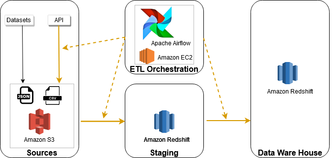

# Covid19 and Air Pollution Data in Germany

The  Covid 19 pandemic has a trastic affect on our lives and economy and therefore potentially on air quality.
In this project a data pipeline was build to update air pollutiona data and covid numbers in Germany on a daily bases and integrate additional data on Germany's population and air stations. To facilitate further analyisis an efficent data model was designed to make data available through Amazon Redshift database.

## Data Sets and Data Sources

### Covid Cases 
The [Robert Koch Institut](https://www.rki.de)  continously monitors covid cases in Germany. The data is updated regularly and accessibele by means of a public [API](https://npgeo-corona-npgeo-de.hub.arcgis.com/datasets/dd4580c810204019a7b8eb3e0b329dd6_0/geoservice?page=2577). Using pagination all data is fetched from this API, relevant information is extracted and stored in a S3 bucket. The resulting JSON format is as follows:
```
{"IdBundesland": 1, "Bundesland": "Schleswig-Holstein", "Landkreis": "SK Flensburg", "Altersgruppe": "A15-A34", "Geschlecht": "M", "AnzahlFall": 1, "AnzahlTodesfall": 0, "ObjectId": 847998, "Meldedatum": 1584144000000, "IdLandkreis": "01001", "Datenstand": "07.04.2020, 00:00 Uhr", "NeuerFall": 0, "NeuerTodesfall": -9, "Refdatum": null, "NeuGenesen": null, "AnzahlGenesen": null}
{"IdBundesland": 1, "Bundesland": "Schleswig-Holstein", "Landkreis": "SK Flensburg", "Altersgruppe": "A15-A34", "Geschlecht": "M", "AnzahlFall": 2, "AnzahlTodesfall": 0, "ObjectId": 847999, "Meldedatum": 1584576000000, "IdLandkreis": "01001", "Datenstand": "07.04.2020, 00:00 Uhr", "NeuerFall": 0, "NeuerTodesfall": -9, "Refdatum": null, "NeuGenesen": null, "AnzahlGenesen": null}
...
```

### Air pollution
The [Umweltbundesamt](https://www.umweltbundesamt.de/) collects [air data](https://www.umweltbundesamt.de/en/data/air/air-data) from stations in Germany. Pollutants include particulate matter (PM10),carbon monoxide (CO), nitrogen dioxide (NO2), Ozone (O3), and sulphur dioxide (SO2). Data for each pollutant is availabe in different time scales (hourly, daily) and can be fetched as a CSV file from a public API. Example of CSV format:
```
"Bundesland / Messnetz";Stationscode;Stationsname;Stationsumgebung;"Art der Station";Schadstoff;"Art der Auswertung";Datum;Uhrzeit;Messwert;Einheit
Brandenburg;DEBB007;Elsterwerda;"vorstädtisches Gebiet";Hintergrund;"Feinstaub (PM₁₀)";"Tagesmittel (1TMW)";01.03.2020;-;4;µg/m³
Brandenburg;DEBB007;Elsterwerda;"vorstädtisches Gebiet";Hintergrund;"Feinstaub (PM₁₀)";"Tagesmittel (1TMW)";02.03.2020;-;5;µg/m³
...
```

### Population 

The [Regionaldatenbank Deutschland](https://www.regionalstatistik.de) provides access to official statistics from federal and state authorities in Germany. Population information on county level, which is partitioned by age groups was retrived from [here](https://www.regionalstatistik.de/genesis/online/data;sid=42E8FFFDC6E60572967A61B6075081E8.reg1?operation=abruftabelleAbrufen&selectionname=12411-02-03-5-B&levelindex=1&levelid=1586513810882&index=6)

Using Google's [Geocoding API](https://developers.google.com/maps/documentation/geocoding/start) the population data was augmented with geolocation (latitude,longitude) information for each county.

## Project Design 

### Data Warehouse Infrastructure



Amazon Redshift was used to build a scalable data warehouse, including staging, processing and transformation to final dimension tables. Data sources are collected in Amazon S3 bucket. Apache Airflow is used to glue togetehr all parts and orchestrate the data pipeline.

### Data Model

A star schema consisting of fact and dimension tables was choosen to model covid and air pollution numbers. As a a denormalized schema it simplifies queries and allows fast aggregations, hence enabling efficient analyisis.


### Data Pipeline

An automatic and reproducable data pipeline was build with Apache Airflow as workflow orchestrator. The pipeline consits of 3 major parts:
1) Fetch covid cases and air pollution data from external APIs and store in S3 bucket.
2) Stage all data sources from S3 to Redshift, check quality of staged data
3) ETL Pipeline to process staged data into final dimension tables, check quality of final tables

The pipeline is scheduled to run every day to fetch the latest data and update the database tables accordingly.


### Conclusion

A scalable and reproducible data workflow was created which is ready for following scenarios:
1) The data was increased by 100x.

The underlying infrastructure can be scaled easily with respect to worker nodes and size of the redshift cluster.

2) The pipelines would be run on a daily basis by 7 am every day.

Apache Airflow as data pipline orchestrator allows configuration when a data pipleine should be schedlued (In this project on a daily basis).

3) The database needed to be accessed by 100+ people

If performance bottle necks arise the redhisft cluster can be scaled accordingly.


## Repository Structure
